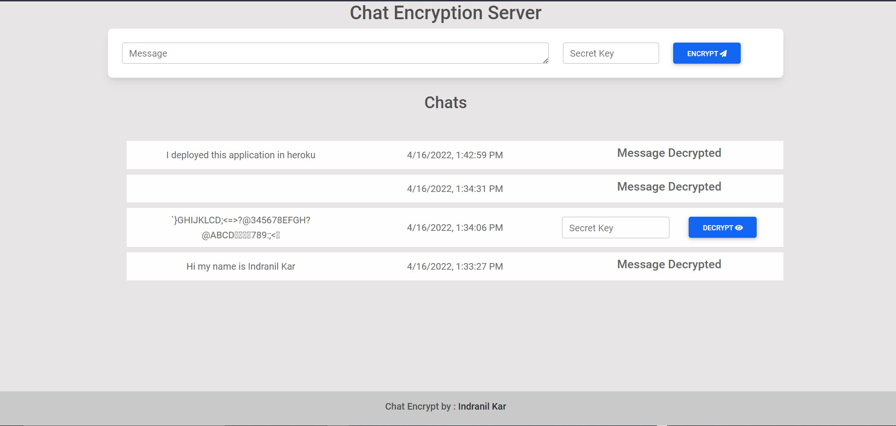

# Encrypt Chat
A message encrypting software that encrypts messages with the help of a secret key , provided by the user and 
decrypts using the same secret key. The message is stored in an encrypted format in the Database.

### Tech Stack :-
- EJS
- Express
- NodeJs
- MongoDb

> ## Run Locally

***To run it locally on you machine you need to have a mongodb url.If you have that , then clone/fork this repo and place mongo url in a .env file with respective key id as mentioned in the code***

### **.env file :** 
``` javascript
DB_URL=<Your MongoDb URI>
```
After that:-

- Open Terminal and write  >
``` bash
npm  install
```

- After installation completes  > 
``` bash
npm start
```

### **Encryption**
- To encrypt a message, enter the message and along with a secret Key.
- After that press the encrypt button to encrypt.
- After successfull encryption,it will be stored as encrypted in db and shown in the list of encrypted messages will be shown in a list, along with the date time and decryption button.
- In the list of encrypted messages ,to decrypt a message, enter the secret key associate with the message and click decrypt.
- The message will be decrypted and shown and the option to decrypt for the message will dissapear , since the message is now decrypted.
- Each time there will be a pop up regarding completion of a operation, such as sucess, errors etc.

## Screenshots

